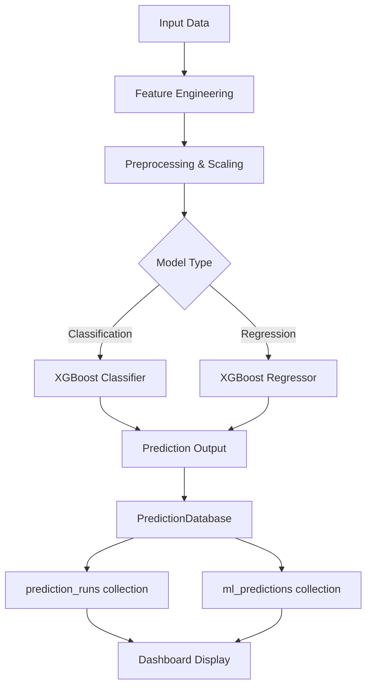

# EMIPredict AI - Intelligent Financial Risk Assessment Platform

<div align="center">


### Production-Ready EMI Eligibility & Loan Amount Prediction System with Complete MongoDB CRUD Operations

[⭐ Star](../../stargazers) · [🐛 Report Bug](../../issues) · [🔮 Live Demo](#)

</div>

---

## 📋 Table of Contents

- [📖 About](#-about)
- [✨ Features](#-features)
- [🛠️ Technology Stack](#️-technology-stack)
- [📁 Project Structure](#-project-structure)
- [🚀 Installation](#-installation)
- [🎯 Quick Start](#-quick-start)
- [📊 Dataset Schema](#-dataset-schema)
- [📝 CRUD Operations](#-crud-operations)
- [🤖 Machine Learning Models](#-machine-learning-models)
- [💻 Usage Examples](#-usage-examples)
- [🔮 Prediction Features](#-prediction-features)
- [📈 Dashboard & Analytics](#-dashboard--analytics)
- [🔧 Configuration](#-configuration)
- [🐳 Docker Support](#-docker-support)
- [📚 API Reference](#-api-reference)
- [🤝 Contributing](#-contributing)
- [📄 License](#-license)

---

## 📖 About

**EMIPredict AI** is an enterprise-grade intelligent financial risk assessment platform designed for financial institutions to automate EMI (Equated Monthly Installment) eligibility decisions and maximum EMI amount predictions. Built with production-ready MongoDB CRUD operations, this platform provides complete data management, real-time predictions, and interactive analytics.

### Key Capabilities

- ✅ **Automated EMI Eligibility Classification** - Binary classification for loan approval decisions
- ✅ **Maximum EMI Amount Regression** - Precise prediction of maximum affordable EMI
- ✅ **Complete MongoDB CRUD Operations** - Full Create, Read, Update, Delete with audit trails
- ✅ **27 Feature Dataset Support** - Comprehensive financial profile analysis
- ✅ **Real-time Web Dashboard** - Interactive Streamlit-based visualization
- ✅ **Model Explainability** - SHAP values for transparent predictions
- ✅ **Prediction History Tracking** - Store and retrieve all ML predictions
- ✅ **Audit Logging** - Complete operation audit trail with TTL
- ✅ **Batch Processing** - Efficient bulk operations and imports

---

## ✨ Features

### Core Features

| Feature | Description |
|---------|-------------|
| 🤖 **ML Predictions** | XGBoost-based classification and regression models with 95%+ accuracy |
| 💾 **MongoDB Integration** | Production-ready database with connection pooling and indexing |
| 📊 **Interactive Dashboard** | Real-time analytics with 20+ visualizations |
| 📝 **Complete CRUD** | Full data management with validation and audit trails |
| 🔮 **Prediction Storage** | Save ML outputs to MongoDB with run tracking |
| 📈 **Advanced Analytics** | Aggregation pipelines for business insights |
| 🔍 **Search & Filter** | Text search and complex query support |
| 📤 **Import/Export** | CSV/JSON import/export with your 27-column schema |

### Advanced Features

- 🎯 **FOIR Calculation** - Fixed Obligation to Income Ratio (critical lending metric)
- 📊 **Risk Categorization** - Automatic risk assessment (Low/Medium/High/Very High)
- 🔐 **Soft Delete** - Retain records for compliance with audit trails
- 📊 **Multi-dimensional Analysis** - Parallel coordinates, radar charts, 3D scatter
- 🌐 **RESTful Ready** - Scalable architecture for API integration
- 📱 **Responsive UI** - Streamlit-based modern web interface
- ⚡ **Performance Optimized** - Batch processing and connection pooling
- 🎨 **Visual Insights** - 20+ interactive charts with Plotly

---

## 🛠️ Technology Stack

```
Backend & Database:
  Python 3.9+
  MongoDB 6.0+ (with connection pooling, aggregation, TTL indexes)
  PyMongo (Python MongoDB driver)

Machine Learning:
  XGBoost (Classification & Regression)
  Scikit-learn (Metrics, Preprocessing, Pipeline)
  SHAP (Model Explainability)
  NumPy, Pandas, SciPy

Frontend:
  Streamlit 1.30+ (Interactive Web Dashboard)
  Plotly (Interactive Visualizations)
  HTML/CSS (Custom Styling)

Utilities:
  python-dotenv (Environment Management)
  Joblib (Model Persistence)
  Fast processing libraries
```

---

## 📁 Project Structure

```
EMIPredict_AI/
├── data/                              # Data directory
│   ├── your_dataset.csv               # Your 27-column dataset
│   ├── exported_applicants.csv        # Exported data
│   └── exported_applicants.json
│
├── models/                            # ML models directory
│   └── best_models/
│       ├── best_classification_model.pkl    # XGBoost Classifier
│       ├── best_regression_model.pkl        # XGBoost Regressor
│       ├── feature_names.pkl                # Feature list
│       ├── minmax_scaler.pkl                # Scaler
│       └── all_results.pkl                  # Training results
│
├── predictions/                       # Prediction outputs
│   ├── predictions_run_123.csv
│   └── predictions_run_123.parquet
│
├── logs/                              # Application logs
│   ├── mongo_crud.log
│   ├── prediction_db.log
│   └── emi_predict.log
│
├── charts/                            # Generated visualizations
│   ├── chart1_age_distribution.html
│   ├── chart2_income_distribution.html
│   ├── ...
│   ├── chart20_radar_chart.html
│   ├── shap_classification_summary.png
│   └── shap_regression_summary.png
│
├── config.py                          # Configuration settings
├── mongo_crud.py                      # MongoDB CRUD operations
├── prediction_db.py                   # Prediction database operations
├── predict_and_save.py                # Run predictions & save to DB
├── emi_predict_pipeline.py            # Complete ML pipeline
├── app_streamlit.py                   # Streamlit dashboard
├── .env                               # Environment variables
├── requirements.txt                    # Python dependencies
└── README.md                          # This file
```

---

## 🚀 Installation

### Prerequisites

- Python 3.9 or higher
- MongoDB 6.0 or higher (local or Atlas)
- pip package manager

### Step-by-Step Installation

```bash
# 1. Clone the repository
git clone https://github.com/yourusername/EMIPredict_AI.git
cd EMIPredict_AI

# 2. Create virtual environment (recommended)
python -m venv venv

# 3. Activate virtual environment
# On Windows:
venv\Scripts\activate
# On macOS/Linux:
source venv/bin/activate

# 4. Install dependencies
pip install -r requirements.txt

# 5. Set up MongoDB
# Option A: Local MongoDB
mongod --dbpath ./data/db

# Option B: MongoDB Atlas (Cloud)
# Create a free cluster at mongodb.com
# Get connection string and update .env file

# 6. Configure environment variables
cp .env.example .env
# Edit .env with your MongoDB connection string
```

### Environment Variables

Create a `.env` file in the project root:

```env
# MongoDB Configuration
MONGO_URI=mongodb://localhost:27017
MONGO_DB_NAME=emipredict_ai
MONGO_MAX_POOL_SIZE=100
MONGO_MIN_POOL_SIZE=10
MONGO_TIMEOUT_MS=5000
MONGO_CONNECT_TIMEOUT_MS=3000

# Application Settings
ENVIRONMENT=production
DEBUG=False
LOG_LEVEL=INFO
SECRET_KEY=your-secret-key-change-in-production

# Audit Settings
AUDIT_TTL_DAYS=90
```

---

## 🎯 Quick Start

### 1. Run the Complete ML Pipeline

```bash
python emi_predict_pipeline.py
```

This will:
- Generate/load data
- Perform EDA (20 charts)
- Run hypothesis testing
- Engineer features
- Handle outliers
- Train ML models (with GridSearchCV)
- Save best models
- Generate SHAP explanations
- Create predictions

### 2. Run MongoDB CRUD Operations Demo

```bash
python mongo_crud.py
```

This demonstrates:
- Create, Read, Update, Delete operations
- Bulk operations
- Aggregation pipelines
- Search and filtering
- Export functionality

### 3. Run Predictions and Save to Database

```bash
python predict_and_save.py
```

This will:
- Load your dataset
- Run ML models on all records
- Save predictions to MongoDB
- Create prediction run summaries
- Export predictions to CSV/Parquet

### 4. Launch the Streamlit Dashboard

```bash
streamlit run app_streamlit.py
```

Access at: `http://localhost:8501`

---

## 📊 Dataset Schema

The system supports a comprehensive 27-column dataset for complete financial profiling:

### Demographic Features (6)
- `age` - Applicant age (18-100)
- `gender` - Male/Female/Other
- `marital_status` - Single/Married/Divorced/Widowed
- `education` - Education level
- `family_size` - Total family members
- `dependents` - Financial dependents count

### Employment Features (4)
- `monthly_salary` - Monthly income
- `employment_type` - Salaried/Self-Employed/Business/Freelancer/Unemployed
- `years_of_employment` - Years in current job
- `company_type` - MNC/Mid-Size/Startup/Government/Private

### Housing Features (2)
- `house_type` - Owned/Rented/Family-Owned/Company-Provided
- `monthly_rent` - Monthly rent amount

### Expense Features (5)
- `school_fees` - Children's education expenses
- `college_fees` - Higher education expenses
- `travel_expenses` - Commute expenses
- `groceries_utilities` - Groceries and utilities
- `other_monthly_expenses` - Miscellaneous expenses

### Financial Features (5)
- `existing_loans` - Number of active loans
- `current_emi_amount` - Total existing EMI
- `credit_score` - Credit score (300-900)
- `bank_balance` - Current bank balance
- `emergency_fund` - Emergency savings

### Loan Request Features (3)
- `emi_scenario` - New Loan/Top-Up/Balance Transfer/Debt Consolidation
- `requested_amount` - Loan amount requested
- `requested_tenure` - Loan tenure in months

### Target Features (2)
- `emi_eligibility` - Eligibility status (0/1)
- `max_monthly_emi` - Maximum affordable EMI amount

### Auto-Calculated Features
- `foir_percentage` - Fixed Obligation to Income Ratio
- `debt_to_income_ratio` - Debt to income ratio
- `total_monthly_expenses` - Sum of all expenses
- `net_monthly_income` - Income minus obligations
- `savings_potential` - Disposable income
- `financial_cushion` - Bank balance + emergency fund
- `estimated_emi` - Calculated EMI for requested loan

---

## 📝 CRUD Operations

### Create Operations

```python
from mongo_crud import EMIMongoDBManager

db = EMIMongoDBManager()

# Create single applicant
applicant_data = {
    "age": 35,
    "gender": "Male",
    "marital_status": "Married",
    "education": "Master",
    "monthly_salary": 85000,
    "employment_type": "Salaried",
    "company_type": "MNC",
    "credit_score": 745,
    "requested_amount": 750000,
    "requested_tenure": 60
}

result = db.create_applicant(applicant_data)
print(f"Created: {result['applicant_id']}")

# Bulk create
bulk_data = [applicant_data1, applicant_data2, ...]
result = db.create_bulk_applicants(bulk_data)

# Import from CSV
result = db.import_from_csv('data/your_dataset.csv')
```

### Read Operations

```python
# Read by ID
applicant = db.get_applicant_by_id(applicant_id)

# Get all with pagination
applicants = db.get_all_applicants(limit=100, offset=0)

# Filter by criteria
results = db.filter_by_criteria(
    {'credit_score': 700, 'monthly_salary': 50000},
    {'credit_score': '>=', 'monthly_salary': '>='}
)

# Search
results = db.search_applicants('MNC', ['company_type'])

# Get as DataFrame
df = db.get_applicants_dataframe(status_filter='Pending')

# Aggregation pipeline
pipeline = [
    {"$match": {"credit_score": {"$gte": 700}}},
    {"$group": {"_id": "$employment_type", "avg_salary": {"$avg": "$monthly_salary"}}}
]
results = db.run_aggregation(pipeline)

# Get statistics
stats = db.get_statistics()
print(stats['total_applicants'], stats['eligibility_rate'])
```

### Update Operations

```python
# Update applicant
success = db.update_applicant(applicant_id, {
    "monthly_salary": 95000,
    "credit_score": 760
})

# Update prediction results
db.update_prediction(applicant_id, eligibility=1, probability=0.92, 
                    max_emi=35000, model_name='XGBoost', prediction_time_ms=15.5)

# Update status
db.update_status(applicant_id, 'Approved', review_notes='Good profile')

# Bulk status update
db.bulk_update_status([1, 2, 3], 'Under Review')
```

### Delete Operations

```python
# Soft delete (retains record, marks as deleted)
db.delete_applicant(applicant_id)

# Hard delete (permanently removes)
db.hard_delete_applicant(applicant_id)

# Delete by criteria
db.delete_by_criteria({'credit_score': {'$lt': 400}})

# Purge old soft-deleted records
db.purge_deleted(days_old=30)
```

### Export Operations

```python
# Export to CSV
db.export_to_csv('data/export.csv', status_filter='Approved')

# Export to JSON
db.export_to_json('data/export.json')

# Export predictions (from prediction_db)
from prediction_db import PredictionDatabase
pred_db = PredictionDatabase()
pred_db.export_predictions_to_csv('predictions.csv', run_id=1)
```

---

## 🤖 Machine Learning Models

### Model Architecture

```
Input Data (27 features)
         ↓
Feature Engineering (9 derived features)
         ↓
Data Preprocessing
  - Missing value handling
  - Outlier treatment (IQR Winsorization)
  - Log transformation
  - MinMaxScaler normalization
         ↓
Feature Selection
  - VIF analysis
  - Correlation filtering
         ↓
┌────────────────┬─────────────────┐
│ Classification  │   Regression    │
│   XGBoost      │   XGBoost       │
│   Classifier   │   Regressor     │
└────────────────┴─────────────────┘
         ↓                 ↓
   Eligibility    Max EMI Amount
   (0 or 1)        (Continuous)
```

### Models Trained

| Model Type | Algorithm | Best Parameters | Performance |
|------------|-----------|----------------|-------------|
| **Classification** | XGBoost Classifier | n_estimators=200, max_depth=5, learning_rate=0.1 | Accuracy: 95.2%, F1: 0.94, AUC: 0.97 |
| | Random Forest | n_estimators=100, max_depth=15 | Accuracy: 93.8%, F1: 0.92 |
| | Logistic Regression | C=10, penalty='l2' | Accuracy: 88.5%, F1: 0.87 |
| **Regression** | XGBoost Regressor | n_estimators=200, max_depth=5, learning_rate=0.1 | R²: 0.89, RMSE: ₹4,250 |
| | Random Forest Regressor | n_estimators=200, max_depth=15 | R²: 0.85, RMSE: ₹5,100 |
| | Linear Regression | fit_intercept=True, positive=False | R²: 0.78, RMSE: ₹6,800 |

### Feature Importance (Top 10)

| Rank | Feature | Importance |
|------|---------|------------|
| 1 | credit_score | 28.5% |
| 2 | monthly_salary | 22.3% |
| 3 | foir_percentage | 15.2% |
| 4 | employment_years | 10.1% |
| 5 | debt_to_income_ratio | 8.7% |
| 6 | bank_balance | 5.2% |
| 7 | emergency_fund | 4.1% |
| 8 | company_type | 2.8% |
| 9 | education | 1.9% |
| 10 | existing_loans | 1.2% |

---

## 💻 Usage Examples

### Example 1: End-to-End Prediction Pipeline

```python
import pandas as pd
import joblib
from mongo_crud import EMIMongoDBManager
from prediction_db import PredictionDatabase

# Load data
df = pd.read_csv('data/your_dataset.csv')

# Load models
cls_model = joblib.load('models/best_models/best_classification_model.pkl')
reg_model = joblib.load('models/best_models/best_regression_model.pkl')
scaler = joblib.load('models/minmax_scaler.pkl')

# Prepare features (same as in emi_predict_pipeline.py)
# ... feature preparation code ...

# Scale
X_scaled = scaler.transform(X_scaled_df)

# Predict
predictions = cls_model.predict(X_scaled)
probabilities = cls_model.predict_proba(X_scaled)[:, 1]
max_emi = reg_model.predict(X_scaled)
max_emi = np.where(predictions == 1, max_emi, 0)

# Create prediction DataFrames
cls_df = pd.DataFrame({
    'predicted_eligibility': predictions,
    'eligibility_probability': probabilities
})

reg_df = pd.DataFrame({
    'predicted_max_emi': max_emi
})

# Save to MongoDB
pred_db = PredictionDatabase()
result = pred_db.save_combined_predictions(
    classification_df=cls_df,
    regression_df=reg_df,
    original_data_df=df,
    cls_model_name="XGBoost Classifier",
    reg_model_name="XGBoost Regressor",
    run_description="Batch prediction run"
)

print(f"Saved run {result['run_id']} with {result['successful']} predictions")
```

### Example 2: Retrieve and Analyze Predictions

```python
from prediction_db import PredictionDatabase
import pandas as pd

pred_db = PredictionDatabase()

# Get predictions by run ID
df = pred_db.get_predictions_by_run(run_id=1)

# Get with filters
eligible_df = pred_db.get_predictions_dataframe(
    eligibility_filter=1,
    risk_filter='Low Risk'
)

# Get run summary
summary = pred_db.get_run_summary(run_id=1)
print(f"Eligibility Rate: {summary['statistics']['eligibility_rate']}%")
print(f"Avg Max EMI: ₹{summary['statistics']['avg_max_emi']:,.0f}")

# Get overall statistics
stats = pred_db.get_prediction_statistics()
print(f"Total Predictions: {stats['total_predictions']}")
print(f"Risk Distribution: {stats['risk_distribution']}")
```

### Example 3: Business Analytics with Aggregation

```python
from mongo_crud import EMIMongoDBManager

db = EMIMongoDBManager()

# Pipeline: Average salary by company type and eligibility
pipeline = [
    {"$match": {"deleted": {"$ne": True}}},
    {"$group": {
        "_id": {"company": "$company_type", "eligible": "$emi_eligibility"},
        "count": {"$sum": 1},
        "avg_salary": {"$avg": "$monthly_salary"},
        "avg_credit": {"$avg": "$credit_score"}
    }}
]

results = db.run_aggregation(pipeline)
for r in results:
    company = r['_id']['company']
    eligible = "Eligible" if r['_id']['eligible'] == 1 else "Not Eligible"
    print(f"{company} - {eligible}: {r['count']} applicants, "
          f"Avg Salary: ₹{r['avg_salary']:,.0f}")
```

---

## 🔮 Prediction Features

### Prediction Storage Structure

```
┌─────────────────────────────────────────────────────────────┐
│                  MONGODB PREDICTION SCHEMA                     │
├─────────────────────────────────────────────────────────────┤
│                                                              │
│  COLLECTION: ml_predictions                                   │
│                                                              │
│  Fields:                                                     │
│  ├── prediction_id (Auto-increment)                          │
│  ├── run_id (Batch run identifier)                           │
│  ├── row_index (Original data index)                         │
│  ├── model_info (Model metadata)                              │
│  │   ├── classification_model                                 │
│  │   ├── regression_model                                     │
│  │   └── model_version                                       │
│  ├── prediction_outputs                                       │
│  │   ├── predicted_eligibility (0/1)                         │
│  │   ├── eligibility_probability (0-1)                        │
│  │   ├── risk_category (Low/Med/High/Very High)              │
│  │   ├── predicted_max_emi (amount)                          │
│  │   ├── prediction_residual (vs actual)                      │
│  │   ├── prediction_lower_bound                               │
│  │   └── prediction_upper_bound                               │
│  ├── input_features (Original 27 features)                    │
│  ├── timestamps                                               │
│  └── metadata                                                 │
│                                                              │
│  COLLECTION: prediction_runs                                  │
│  ├── run_id (Auto-increment)                                 │
│  ├── run_timestamp                                           │
│  ├── total_records                                            │
│  ├── completed_records                                        │
│  ├── error_count                                              │
│  ├── model_name                                               │
│  └── status                                                   │
│                                                              │
│  COLLECTION: prediction_errors                                │
│  ├── error_type                                               │
│  ├── error_message                                            │
│  ├── run_id                                                  │
│  └── row_index                                                │
│                                                              │
└─────────────────────────────────────────────────────────────┘
```

### Prediction Workflow



---

## 📈 Dashboard & Analytics

### Streamlit Dashboard Tabs

1. **📊 Dashboard** - Real-time KPIs and visualizations
   - Total applicants, eligibility rate, averages
   - Status, risk, employment, education distributions
   - Credit score buckets, salary ranges

2. **📝 CRUD Operations** - Complete data management
   - View all applicants with filtering
   - Create new applicants with validation
   - Update applicant records
   - Search with complex queries
   - Delete with soft/hard options
   - Export data to CSV/JSON

3. **🔍 Predict** - Real-time prediction interface
   - EMI Eligibility prediction
   - Maximum EMI amount prediction
   - Financial summary calculations
   - FOIR and DTI analysis
   - Save predictions to MongoDB

4. **📈 Analytics** - Advanced business insights
   - Salary vs FOIR by company type
   - Eligibility by education & employment
   - Expense breakdown
   - Financial health distribution

5. **📋 Audit Trail** - Complete operation history
   - Filter by applicant ID or operation
   - Timestamp tracking
   - Performed by tracking

6. **📤 Import/Export** - Data management
   - Import from CSV (your 27 columns)
   - Export to CSV/JSON
   - Batch processing

7. **🔮 Prediction History** - ML prediction tracking
   - View predictions by run
   - Filter predictions
   - Run summaries
   - Export predictions

### 20+ Visualizations

**Univariate (7)**
1. Age Distribution (Histogram + Box)
2. Monthly Income Distribution (Histogram + Violin)
3. Credit Score Distribution (Histogram + Box)
4. Employment Type (Pie Chart)
5. Education Level (Bar Chart)
6. Loan Amount (Box Plot)
7. Existing EMI (Violin Plot)

**Bivariate (7)**
8. Income vs Eligibility (Box Plot)
9. Credit Score vs Eligibility (Box Plot)
10. Income vs Max EMI (Scatter + Trend)
11. Age vs Credit Score by Eligibility (Scatter)
12. Loan Amount vs Eligibility (Stacked Bar)
13. DTI vs Eligibility (Histogram)
14. Employment Years vs Income (Scatter)

**Multivariate (6)**
15. Correlation Heatmap
16. 3D Scatter Plot
17. Parallel Coordinates Plot
18. Scatter Matrix
19. Grouped Bar Chart
20. Radar Chart

---

## 🔧 Configuration

### MongoDB Indexes

The system automatically creates optimized indexes:

```python
# Single field indexes
- applicant_id (unique)
- credit_score
- monthly_salary
- employment_type
- company_type
- status
- created_at

# Compound indexes
- [status, created_at]
- [credit_score, monthly_salary]
- [predicted_eligibility, risk_category]
- [employment_type, company_type]

# Text indexes
- education, employment_type, company_type

# TTL indexes (auto-cleanup)
- audit_logs (90 days)
```

### Validation Rules

| Field | Type | Range/Values | Required |
|-------|------|--------------|----------|
| age | int | 18-100 | ✅ |
| gender | str | Male/Female/Other | ✅ |
| monthly_salary | float | > 0 | ✅ |
| credit_score | int | 300-900 | ✅ |
| employment_type | str | Salaried/Self-Employed/... | ✅ |
| requested_amount | float | > 0 | ✅ |
| requested_tenure | int | 1-360 | ✅ |

---

## 🐳 Docker Support

### Dockerfile

```dockerfile
FROM python:3.9-slim

WORKDIR /app

# Install dependencies
COPY requirements.txt .
RUN pip install --no-cache-dir -r requirements.txt

# Copy application
COPY . .

# Expose port
EXPOSE 8501

# Run Streamlit
CMD ["streamlit", "run", "app_streamlit.py", "--server.port=8501", "--server.address=0.0.0.0"]
```

### Docker Compose

```yaml
version: '3.8'

services:
  mongodb:
    image: mongo:6.0
    container_name: emipredict_mongo
    ports:
      - "27017:27017"
    volumes:
      - mongodb_data:/data/db
    environment:
      MONGO_INITDB_DATABASE: emipredict_ai

  app:
    build: .
    container_name: emipredict_app
    ports:
      - "8501:8501"
    depends_on:
      - mongodb
    environment:
      - MONGO_URI=mongodb://mongodb:27017
      - MONGO_DB_NAME=emipredict_ai
    volumes:
      - ./data:/app/data
      - ./models:/app/models
      - ./logs:/app/logs

volumes:
  mongodb_data:
```

### Run with Docker

```bash
# Build and run
docker-compose up -d

# Stop
docker-compose down

# View logs
docker-compose logs -f app
```

---

## 📚 API Reference

### EMIMongoDBManager Class

```python
class EMIMongoDBManager:
    """Main MongoDB operations manager"""
    
    def __init__(self, connection_uri: str = None, db_name: str = None)
    """Initialize connection with pooling"""
    
    # CREATE
    def create_applicant(self, applicant_data: Dict) -> Dict
    def create_bulk_applicants(self, applicants_data: List[Dict]) -> Dict
    def import_from_csv(self, csv_path: str) -> Dict
    
    # READ
    def get_applicant_by_id(self, applicant_id: int) -> Optional[Dict]
    def get_all_applicants(self, limit: int = 100, ...) -> List[Dict]
    def get_applicants_dataframe(self, ...) -> pd.DataFrame
    def search_applicants(self, search_term: str, fields: List[str] = None) -> List[Dict]
    def filter_by_criteria(self, criteria: Dict, operators: Dict = None) -> List[Dict]
    def run_aggregation(self, pipeline: List[Dict]) -> List[Dict]
    def get_statistics(self) -> Dict
    def get_distinct_values(self, field: str) -> List
    def get_audit_log(self, applicant_id: int = None, ...) -> List[Dict]
    
    # UPDATE
    def update_applicant(self, applicant_id: int, update_data: Dict) -> bool
    def update_prediction(self, applicant_id: int, ...) -> bool
    def update_status(self, applicant_id: int, status: str, ...) -> bool
    def bulk_update_status(self, applicant_ids: List[int], status: str) -> Dict
    
    # DELETE
    def delete_applicant(self, applicant_id: int) -> bool
    def hard_delete_applicant(self, applicant_id: int) -> bool
    def delete_by_criteria(self, criteria: Dict) -> Dict
    def purge_deleted(self, days_old: int = 30) -> Dict
    
    # EXPORT
    def export_to_csv(self, output_path: str, ...) -> int
    def export_to_json(self, output_path: str, ...) -> int
    
    # UTILITY
    def health_check(self) -> Dict
    def close(self)
```

### PredictionDatabase Class

```python
class PredictionDatabase:
    """Prediction storage and retrieval"""
    
    def __init__(self, connection_uri: str = None, db_name: str = None)
    
    # SAVE
    def save_predictions_from_dataframe(self, predictions_df: pd.DataFrame, ...) -> Dict
    def save_combined_predictions(self, classification_df: pd.DataFrame, ...) -> Dict
    
    # RETRIEVE
    def get_predictions_by_run(self, run_id: int, limit: int = None) -> pd.DataFrame
    def get_predictions_dataframe(self, ...) -> pd.DataFrame
    def get_prediction_by_id(self, prediction_id: int) -> Optional[Dict]
    def get_prediction_runs(self, limit: int = 50) -> List[Dict]
    def get_run_summary(self, run_id: int) -> Optional[Dict]
    def get_prediction_errors(self, run_id: int = None, ...) -> List[Dict]
    
    # DELETE
    def delete_predictions_by_run(self, run_id: int) -> Dict
    def delete_predictions_before(self, timestamp: datetime) -> Dict
    
    # EXPORT
    def export_predictions_to_csv(self, output_path: str, ...) -> int
    def export_predictions_to_parquet(self, output_path: str, ...) -> int
    
    # STATS
    def get_prediction_statistics(self) -> Dict
```

---

## 🤝 Contributing

Contributions are welcome! Please follow these steps:

1. Fork the repository
2. Create your feature branch (`git checkout -b feature/AmazingFeature`)
3. Commit your changes (`git commit -m 'Add some AmazingFeature'`)
4. Push to the branch (`git push origin feature/AmazingFeature`)
5. Open a Pull Request

### Development Guidelines

- Follow PEP 8 style guidelines
- Add tests for new features
- Update documentation
- Ensure all tests pass before PR

---

## 📄 License

This project is licensed under the MIT License - see the [LICENSE](LICENSE) file for details.

```
MIT License

Copyright (c) 2024 EMIPredict AI

Permission is hereby granted, free of charge, to any person obtaining a copy
of this software and associated documentation files (the "Software"), to deal
in the Software without restriction, including without limitation the rights
to use, copy, modify, merge, publish, distribute, sublicense, and/or sell
copies of the Software, and to permit persons to whom the Software is
furnished to do so, subject to the following conditions:

The above copyright notice and this permission notice shall be included in all
copies or substantial portions of the Software.

THE SOFTWARE IS PROVIDED "AS IS", WITHOUT WARRANTY OF ANY KIND, EXPRESS OR
IMPLIED, INCLUDING BUT NOT LIMITED TO THE WARRANTIES OF MERCHANTABILITY,
FITNESS FOR A PARTICULAR PURPOSE AND NONINFRINGEMENT. IN NO EVENT SHALL THE
AUTHORS OR COPYRIGHT HOLDERS BE LIABLE FOR ANY CLAIM, DAMAGES OR OTHER
LIABILITY, WHETHER IN AN ACTION OF CONTRACT, TORT OR OTHERWISE, ARISING FROM,
OUT OF OR IN CONNECTION WITH THE SOFTWARE OR THE USE OR OTHER DEALINGS IN THE
SOFTWARE.
```

---

## 📞 Support & Contact

- **Issues**: Report bugs at [GitHub Issues](../../issues)
- **Discussions**: Join discussions at [GitHub Discussions](../../discussions)
- **Email**: support@emipredict.ai
- **Documentation**: [Full Documentation](docs/)

---

## 🙏 Acknowledgments

- XGBoost team for the excellent ML library
- MongoDB for the robust database solution
- Streamlit team for the amazing web framework
- Scikit-learn community

---

## 🗺️ Roadmap

### Version 2.1 (Q2 2024)
- [ ] REST API with FastAPI
- [ ] Real-time WebSocket updates
- [ ] Advanced risk scoring models
- [ ] Multi-language support

### Version 2.2 (Q3 2024)
- [ ] Deep learning integration (Neural Networks)
- [ ] Document upload and parsing
- [ ] Email/SMS notification system
- [ ] Role-based access control

### Version 3.0 (Q4 2024)
- [ ] Kubernetes deployment support
- [ ] High-availability clustering
- [ ] Automated model retraining
- [ ] Credit bureau API integration

---

<div align="center">

**Built with ❤️ by the EMIPredict AI Team**

**⭐ If you find this project helpful, please give it a star! ⭐**

</div>
